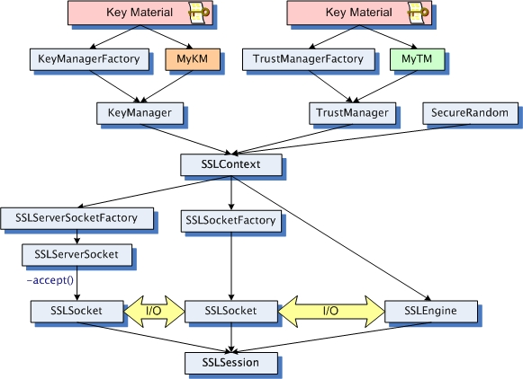

# Domain Specific Languages with Kotlin

_Disclaimer: My articles are published under 
<a href="https://creativecommons.org/licenses/by-nc-nd/4.0/legalcode" target="_blank">"Attribution-NonCommercial-NoDerivatives 4.0 International (CC BY-NC-ND 4.0)"</a>._

© Copyright: Simon Wirtz, 2017
https://blog.simon-wirtz.de/kotlin-on-the-jvm-byte-code-generation/

Feel free to share.

## Motivation

If you’ve been following my recent posts about [Kotlin](http://kotlinlang.org), you’ve probably noticed me mentioning **Domain Specific Languages (DSL)** already. **Kotlin** as a programming
language provides some powerful features that allow us to create those
DSLs. One of these features, I also already introduced, is called
[Function Literals with Receiver](https://blog.simon-wirtz.de/function-literals-with-receiver-quick-introduction/),
others are the [invoke convention](https://blog.simon-wirtz.de/kotlin-conventions-operator-overloading/)
or [infix notation](https://kotlinlang.org/docs/reference/functions.html#infix-notation).

In this post we’ll have a look at the concept of DSLs and certainly see
how we can create one with Kotlin in a relatively simple example:  
I’ve often been struggling with Java’s API for setting up *SSL/TLS
connections* in scenarios where *https* communication is required for
example. Just recently, I had to implement different kinds of these in
one of our applications and I once again felt like wanting to write a
little library that can support me with that task, hiding away all the
difficulties and of course the boilerplate.

## Domain Specific Language

The term *Domain Specific Language* is used very broadly nowadays, but
in the case of what I’ll be talking about it’s referring to some kind of
**"mini-language"** used to describe the construction of a specific
domain object in a semi-declarative way. Examples of DSLs are [Groovy builders](http://www.groovy-lang.org/dsls.html#_nodebuilder) for
creating XML, HTML or UI data. The best example in my opinion though is
[Gradle](https://en.wikipedia.org/wiki/Gradle), which also uses
Groovy-based DSLs for describing software build automations [1].  
To put its purpose simply, DSLs are a way of providing an *API* that is
cleaner, more readable and, most importantly, more structured than
traditional APIs. Instead of having to call individual functions in an
*imperative* way, DSLs use nested descriptions, which creates clean
structures, we could even call it "grammar". DSLs define possibilities
of combining different constructs with each other and also make use of
scopes, in which different functionalities can be used.

### Why Kotlin is particularly good for DSLs

As we already know, Kotlin is a statically typed language, which enables
features that aren’t available in dynamically typed languages like
Groovy. Most importantly, static typing allows error detection at
compile time and much better IDE support in general.

Okay, let’s not waste time with theory and start having fun with DSLs,
meaning a lot of nested lambdas! So, you better know how to use
[lambdas](https://kotlinlang.org/docs/reference/lambdas.html) in Kotlin
:)

## Kotlin DSL by Example

As already stated in the introductory part of this post, we’ll use
Java’s API for setting up SSL/TLS connections as an example here. If
you’re not familiar with it, let’s introduce it shortly.

### Java Secure Socket Extension

[Java Secure Socket Extension (JSSE)](http://docs.oracle.com/javase/8/docs/technotes/guides/security/jsse/JSSERefGuide.html)
is a library that’s part of Java SE since 1.4 providing functionalities
for creating secure connections via SSL/TLS, including client/server
authentication, data encryption and message integrity. As most of you, I
find security topics rather tricky despite the fact that I’m using the
features quite often in my day-to-day work. One reason for this probably
is the great number of possible API combinations, another its verbosity
needed to set up such connections. Have a look at the class hierarchy:




Quite a few classes, don’t you think? You often start at the very
beginning by creating a *trust* and a *key* store and use these together
with a random generator for setting up the `SSLContext`. This can be
used for a factory which then can create your `Socket`. Let’s be honest,
it does not sound too difficult, but let’s see it in action, the Java
way…

### Set up TLS connection with Java

It needed more than 100 lines of code to do this. It’s a connection with
mutual authentication, which is needed if both parties, client and
server need to trust each other.

```java

public class TLSConfiguration { ... }
public class StoreType { ... }

public void connectSSL(String host, int port,
    TLSConfiguration tlsConfiguration) throws IOException {

    String tlsVersion = tlsConfiguration.getProtocol();
    StoreType keystore = tlsConfiguration.getKeystore();
    StoreType trustStore = tlsConfiguration.getTruststore();
    try {
        SSLContext ctx = SSLContext.getInstance(tlsVersion);
        TrustManager[] tm = null;
        KeyManager[] km = null;
        if (trustStore != null) {
            tm = getTrustManagers(trustStore.getFilename(), trustStore.getPassword().toCharArray(),
                    trustStore.getStoretype(), trustStore.getAlgorithm());
        }
        if (keystore != null) {
            km = createKeyManagers(keystore.getFilename(), keystore.getPassword(),
                    keystore.getStoretype(), keystore.getAlgorithm());
        }
        ctx.init(km, tm, new SecureRandom());
        SSLSocketFactory sslSocketFactory = ctx.getSocketFactory();
        SSLSocket sslSocket = (SSLSocket) sslSocketFactory.createSocket(host, port);
        sslSocket.startHandshake();
    } catch (Exception e) {
        throw new IllegalStateException("Not working :-(", e);
    }
}


private static TrustManager[] getTrustManagers(
    final String path, final char[] password,
    final String storeType, final String algorithm) throws Exception {

    TrustManagerFactory fac = TrustManagerFactory.getInstance(algorithm == null ? "SunX509" : algorithm);
    KeyStore ks = KeyStore.getInstance(storeType == null ? "JKS" : storeType);
    Path storeFile = Paths.get(path);
    ks.load(new FileInputStream(storeFile.toFile()), password);
    fac.init(ks);
    return fac.getTrustManagers();
}

private static KeyManager[] createKeyManagers(
    final String filename, final String password,
    final String keyStoreType, final String algorithm) throws Exception {

    KeyStore ks = KeyStore.getInstance(keyStoreType == null ? "PKCS12" : keyStoreType);
    ks.load(new FileInputStream(filename), password.toCharArray());
    KeyManagerFactory kmf = KeyManagerFactory.getInstance(algorithm == null ? "SunX509" : algorithm);
    kmf.init(ks, password.toCharArray());
    return kmf.getKeyManagers();
}
``` 


Okay, it’s Java right? Of course it’s verbose with lots of checked
exceptions and resources to be handled, which I simplified already here
for the sake of brevity. As a next step, let’s convert this stuff into
concise Kotlin code and then provide a DSL for clients willing to set up
TLS connections.

### Set up TLS connection with Kotlin

```kotlin
fun connectSSL(host: String, port: Int, protocols: List<String>, kmConfig: Store?, tmConfig: Store?){
    val context = createSSLContext(protocols, kmConfig, tmConfig)
    val sslSocket = context.socketFactory.createSocket(host, port) as SSLSocket
    sslSocket.startHandshake()
}

fun createSSLContext(protocols: List<String>, kmConfig: Store?, tmConfig: Store?): SSLContext {
    if (protocols.isEmpty()) {
        throw IllegalArgumentException("At least one protocol must be provided.")
    }
    return SSLContext.getInstance(protocols[0]).apply {
        val keyManagerFactory = kmConfig?.let { conf ->
            val defaultAlgorithm = KeyManagerFactory.getDefaultAlgorithm()
            KeyManagerFactory.getInstance(conf.algorithm ?: defaultAlgorithm).apply {
                init(loadKeyStore(conf), conf.password)
            }
        }
        val trustManagerFactory = tmConfig?.let { conf ->
            val defaultAlgorithm = TrustManagerFactory.getDefaultAlgorithm()
            TrustManagerFactory.getInstance(conf.algorithm ?: defaultAlgorithm).apply {
                init(loadKeyStore(conf))
            }
        }

        init(keyManagerFactory?.keyManagers, trustManagerFactory?.trustManagers,
            SecureRandom())
    }

}

fun loadKeyStore(store: Store) = KeyStore.getInstance(store.fileType).apply {
    load(FileInputStream(store.name), store.password)
}
```


You might notice, that I haven’t done a one-to-one conversion here,
which is because Kotlin provides a few functions in its stdlib, which
help a lot here. This small piece of source code contains 4 usages of
`apply`, a method that makes use of [Function Literals with Receiver](https://blog.simon-wirtz.de/function-literals-with-receiver-quick-introduction/).
It allows us to omit particular statements by creating a context to be
reused inside the lambda block passed to it, just like a DSL does as
we’ll see in a minute. The object on which `apply` is called becomes the
functions **receiver**, which then can be used in the lambda by `this`,
i.e. members can be used without any additional prefix. Have a look at
my blog post about these function literals, if it’s still too vague.

We’ve seen by now that Kotlin can be a lot more concise than Java, but
that’s common knowledge already. We now want to wrap this code inside a
DSL, which then can be used by clients for describing how their TSL
connections shall look like.

### Creating our DSL

The first thing to think about when creating an API, and this certainly
also applies to DSLs, is what a client is supposed to be asked for: What
configuration parameters do we need from the library user? In our case
this is quite simple. We need zero or one descriptions for a *keystore*
and a *truststore* respectively. Also, it’s important to know the
accepted *cipher suites* and the socket *connection timeout*. Last but
not least, it’s mandatory to provide a set of protocols for our
connection, which could be *TLSv1.2* for example. For every
configuration value, defaults are available and will be used if
necessary. This can easily be wrapped in a configuration class, which
we’ll call `ProviderConfiguration` because it will configure our
`TLSSocketFactoryProvider` later on.

```kotlin

class ProviderConfiguration {

    var kmConfig: Store? = null
    var tmConfig: Store? = null
    var socketConfig: SocketConfiguration? = null

    fun open(name: String) = Store(name)

    fun sockets(configInit: SocketConfiguration.() -> Unit) {
        this.socketConfig = SocketConfiguration().apply(configInit)
    }

    fun keyManager(store: () -> Store) {
        this.kmConfig = store()
    }

    fun trustManager(store: () -> Store) {
        this.tmConfig = store()
    }
}

```

We’ve got 3 nullable properties here, each of which are `null` by
default, because the client might not want to configure everything for
the connection. The important methods here are `sockets`, `keyManager`
and `trustManager`, which have a single parameter with function types.
The first one goes even further by defining a function literal *with
receiver*, which is `SocketConfiguration` here. This enables the client
to pass in a lambda which has access to all members of
`SocketConfiguration` as we know it from extension functions, too. The
`socket` method *provides* the receiver by creating a new instance and
then invoking the passed function on it with `apply`. The resulting,
configured instance, is then used as a value for the internal property.
The other two functions are a bit easier as they define simple functions
types, without a receiver. They simply expect a function to be passed
that returns an instance of `Store`, which then is set on the internal
property.

Let’s also review the classes `Store` and `SocketConfiguration` now.

```kotlin

data class SocketConfiguration(var cipherSuites: List<String>? = null, var timeout: Int? = null, var clientAuth: Boolean = false)

class Store(val name: String) {
    var algorithm: String? = null
    var password: CharArray? = null
    var fileType: String = "JKS"

    infix fun withPass(pass: String) = apply {
        password = pass.toCharArray()
    }

    infix fun beingA(type: String) = apply {
        fileType = type
    }

    infix fun using(algo: String) = apply {
        algorithm = algo
    }
}
```

The first one is as easy as it could get, a simple data class with, once
again, nullable properties. `Store` is a bit unique though as it only
defines 3 `infix` functions, which actually are simple setters for the
properties. We use `apply` here, because it returns the applied objects
afterwards. This enables us to chain the setters easily. One thing I
haven’t mentioned so far is the function `open(name: String)` in
`ProviderConfiguration`. This can be used as a factory for
`Store`s what we’ll see in action soon. This all in combination
allows a neat way of defining our configuration. But before we can have
a look at the client side, let’s first observe the
`TLSSocketFactoryProvider`, which wants to be configured with the
classes we just saw.

```kotlin

class TLSSocketFactoryProvider(init: ProviderConfiguration.() -> Unit) {

    private val config: ProviderConfiguration = ProviderConfiguration().apply(init)

    fun createSocketFactory(protocols: List<String>): SSLSocketFactory = with(createSSLContext(protocols)) {
        return ExtendedSSLSocketFactory(
            socketFactory, protocols.toTypedArray(),
            getOptionalCipherSuites() ?: socketFactory.defaultCipherSuites)
    }

    fun createServerSocketFactory(protocols: List<String>): SSLServerSocketFactory = with(createSSLContext(protocols)){
        return ExtendedSSLServerSocketFactory(
            serverSocketFactory, protocols.toTypedArray(),
            getOptionalCipherSuites() ?: serverSocketFactory.defaultCipherSuites)
    }

    private fun getOptionalCipherSuites() = config.socketConfig?.cipherSuites?.toTypedArray()


    private fun createSSLContext(protocols: List<String>): SSLContext {
        //... already known
    }
}
``` 

This one isn’t hard to understand either as most of its content isn’t
displayed here since we already know it from
a previous exmaple, which is `createSSLContext` in
particular. The most important thing in this listing is the constructor.
It expects a function with a `ProviderConfiguration` as a receiver.
Internally it creates a new instance of it and calls this function in
order to initialize the configuration. The configuration is used in
`TLSSocketFactoryProvider`'s other functions for setting up a
`SocketFactory` as soon as one of the public methods is called, which
are `createSocketFactory` and `createServerSocketFactory` respectively.
In order to assemble this all together, a top-level function has to be
created, which will be the client’s entry point to the DSL world then.

```kotlin
val defaultTLSProtocols = listOf("TLSv1.2")

fun serverSocketFactory(
    protocols: List<String> = defaultTLSProtocols, configuration: ProviderConfiguration.() -> Unit = {}) =
        with(TLSSocketFactoryProvider(configuration)) {
            this.createServerSocketFactory(protocols)
        }

fun socketFactory(
    protocols: List<String> = defaultTLSProtocols, configuration: ProviderConfiguration.() -> Unit = {}) =
        with(TLSSocketFactoryProvider(configuration)) {
            this.createSocketFactory(protocols)
        }

``` 

Two simple functions delegating a function literal with
`ProviderConfiguration` receiver to a created instance of
`TLSSocketFactoryProvider`, on which the public methods
`createSocketFactory` and `createServerSocketFactory` are called.

Now we can easily use it to create new socket factories.

```kotlin

val fac = socketFactory {
    keyManager {
        open("certsandstores/clientkeystore") withPass "123456" beingA "jks"
    }
    trustManager {
        open("certsandstores/myTruststore") withPass "123456" beingA "jks"
    }
    sockets {
        cipherSuites =
        listOf("TLS_ECDHE_RSA_WITH_AES_128_GCM_SHA256",
                "TLS_ECDHE_RSA_WITH_AES_256_GCM_SHA384",
                "TLS_DHE_RSA_WITH_AES_128_CBC_SHA",
                "TLS_DHE_RSA_WITH_AES_256_CBC_SHA")
        timeout = 10_000
    }
}

val socket = fac.createSocket("192.168.3.200", 9443)

```

Let’s recap: Top-level function `socketFactory` expects a lambda, which
has access to `ProviderConfiguration` members since it’s the lambda’s
receiver. Therefore we can call `keyManager()` `trustManager()` and
`sockets()` without any additional prefix here. `keyManager()` and
`trustManager()` want us to provide a `Store`, which we create by
calling `ProviderConfiguration::open` and `Store`'s infix
functions. The `sockets()` method is different as it expects a function
literal with `SocketConfiguration` receiver, which is a data class and
therefore provides access on its properties directly.

I hope this is understandable - Once again, it’s important to know how
lambdas look like in Kotlin, those with receivers in particular.

This is a very clean definition of a `SocketFactory` if you ask me. One
more feature, such a DSL provides, is of course the possibility to use
*any other Kotlin code* available in the receiver’s contexts. You could
easily read values from a file for creating your store configurations or
use loops, `if`s, `when`s etc. whenever you need to:

```kotlin

val fac = socketFactory {
    trustManager {
        if (System.currentTimeMillis() % 2 == 0L) {
            open("any") withPass "123456" beingA "jks"
        } else {
            open("other") withPass "123456" beingA "jks"
        }
    }
}
``` 

## TlsLibrary on GitHub


The code we just looked at is available on
[GitHub](https://github.com/s1monw1/TLSLibrary) and wants to be
observed. If you have any ideas or concerns, just tell me. As this is
just a first trial and might change in future releases, I created a
branch "Blog", which contains the state described here and won’t be
touched by me.

For those of you being experts in TLS and the JSSE lib in particular:
I’m aware, that many cases and possibilities contained in JSSE can’t be
accomplished yet. It’s meant to be extended as soon as someone really
needs it :)

## Wrap-up


We’ve seen why DSLs can be a better way of providing APIs to a client by
the example of setting up a TLS connection using the JSSE library.
Kotlin is a really great language for writing such APIs because of its
static typing and great features, as we saw. There are a lot more Kotlin
DSL example available already. If you like, have a look at
[Kotlintest](https://github.com/kotlintest/kotlintest) or
[kotlinx.html](https://github.com/Kotlin/kotlinx.html).

If you like to have a look at my examples, the code is available here:
[TlsLibrary](https://github.com/s1monw1/TLSLibrary), "Blog" branch. Feel
free, to give any feedback, I’m always happy to help. Also, If you like,
have a look at my [Twitter](https://twitter.com/s1m0nw1) account and
follow if you’re interested in more Kotlin stuff :) Thanks a lot.


[1] There’s also a Kotlin DSL for Gradle available:
[Gradle-Script-Kotlin](https://github.com/gradle/kotlin-dsl)
